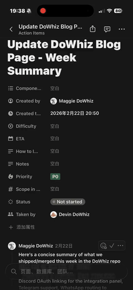
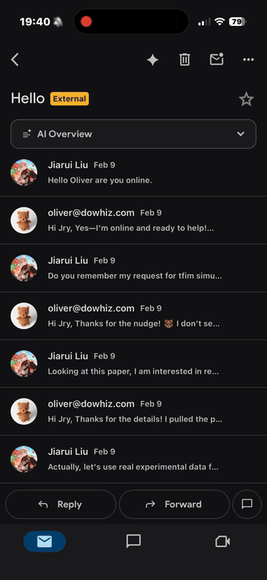
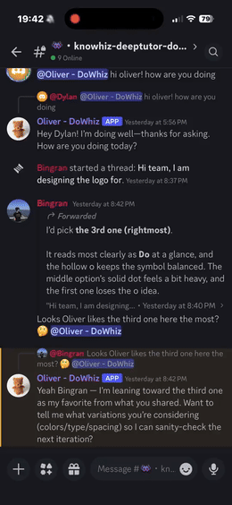

# DoWhiz - One-click startup workspace for founders and digital founding teams.

<p align="center"><strong>Product Shorts</strong></p>

<table align="center">
  <tr>
    <td align="center">
      <a href="https://www.youtube.com/shorts/SI9mxW_Top0">
        
      </a>
    </td>
    <td align="center">
      <a href="https://www.youtube.com/shorts/PSsJ7WBk71w">
        
      </a>
    </td>
    <td align="center">
      <a href="https://www.youtube.com/shorts/5H9g3LOGkMc">
        
      </a>
    </td>
  </tr>
  <tr>
    <td align="center"><sub><a href="https://www.youtube.com/shorts/SI9mxW_Top0">DoWhiz employee in Notion</a></sub></td>
    <td align="center"><sub><a href="https://www.youtube.com/shorts/PSsJ7WBk71w">DoWhiz employee in Email</a></sub></td>
    <td align="center"><sub><a href="https://www.youtube.com/shorts/5H9g3LOGkMc">DoWhiz employee in Discord</a></sub></td>
  </tr>
</table>

<p align="center"><sub>Tap any preview to watch the full Shorts video.</sub></p>

DoWhiz is an agent-native startup workspace platform.

Current product model:
- Solo-founder-first onboarding to generate a startup workspace blueprint.
- Workspace-first operating surface for resources, tasks, artifacts, approvals, and memory.
- Multi-channel execution across email, Slack/Discord, GitHub, Google Docs, and related surfaces.

Current production model:
- `inbound_gateway` handles ingress (email/webhooks/chat events) and enqueue.
- `rust_service` workers consume queue items and execute tasks.
- Task state is Mongo-backed; account/auth/billing data is in Supabase Postgres.

## Quick Start (Local)

Prerequisites:
- Rust toolchain
- Node.js 20+
- `ngrok` (only for local public webhook testing)

1. Configure env:
```bash
cp .env.example DoWhiz_service/.env
# fill required keys in DoWhiz_service/.env
```

2. Start one worker:
```bash
./DoWhiz_service/scripts/run_employee.sh little_bear 9001 --skip-hook --skip-ngrok
```

3. Start inbound gateway:
```bash
./DoWhiz_service/scripts/run_gateway_local.sh
```

4. (Optional local webhook) expose gateway + update Postmark hook:
```bash
ngrok http 9100
cd DoWhiz_service
cargo run -p scheduler_module --bin set_postmark_inbound_hook -- \
  --hook-url https://YOUR-NGROK-DOMAIN/postmark/inbound
```

## Runtime Flow

```text
Inbound message
  -> inbound_gateway (route + dedupe + raw payload storage)
  -> ingestion queue (Service Bus in gateway path)
  -> rust_service worker (consume + schedule)
  -> run_task_module (Codex/Claude)
  -> outbound reply (email/slack/discord/sms/telegram/whatsapp/google workspace)
```

## Repository Layout

- `DoWhiz_service/`: Rust backend and operations scripts
- `website/`: React/Vite web frontend
- `reference_documentation/`: architecture notes, test plans, product vision
- `assets/`, `example_files/`: supporting assets and fixtures

## Read Next

- Service docs: [`DoWhiz_service/README.md`](DoWhiz_service/README.md)
- Operations runbook: [`DoWhiz_service/OPERATIONS.md`](DoWhiz_service/OPERATIONS.md)
- Deployment policy: [`DoWhiz_service/docs/staging_production_deploy.md`](DoWhiz_service/docs/staging_production_deploy.md)
- Test checklist: [`reference_documentation/test_plans/DoWhiz_service_tests.md`](reference_documentation/test_plans/DoWhiz_service_tests.md)
- Vision: [`reference_documentation/vision.md`](reference_documentation/vision.md)

## Branch / Deploy Policy

- Staging deploy branch: `dev`
- Production deploy branch: `main`
