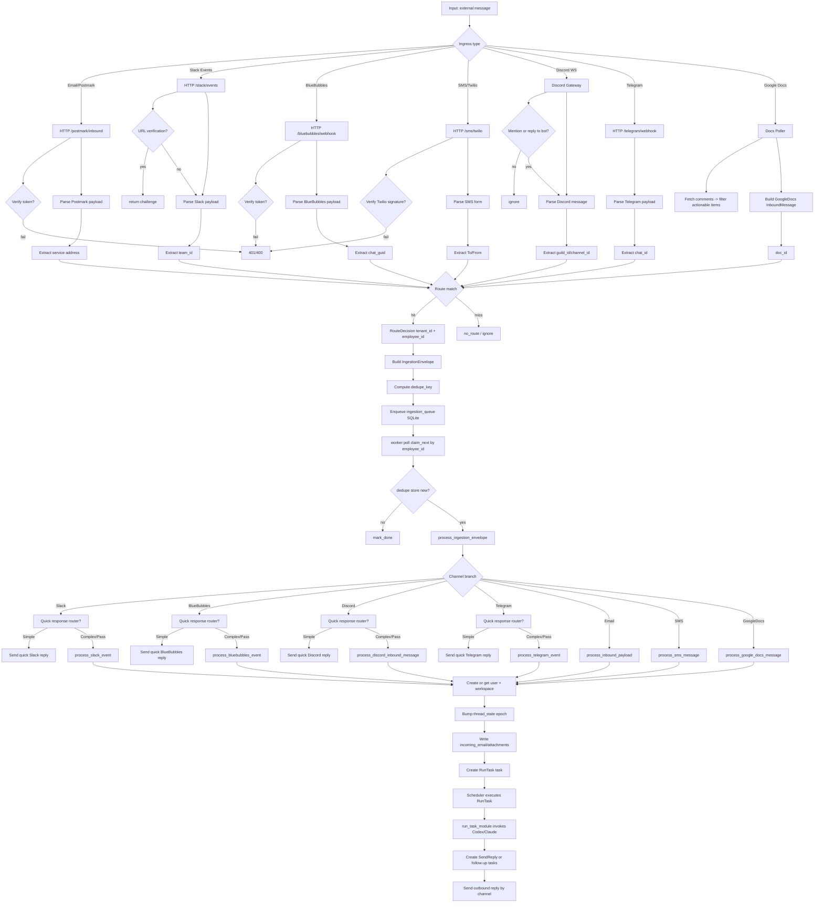

```mermaid
flowchart TD
  A[Input: external message] --> B{Ingress type}
  B -->|Email/Postmark| C1[HTTP /postmark/inbound]
  B -->|Slack Events| C2[HTTP /slack/events]
  B -->|BlueBubbles| C3[HTTP /bluebubbles/webhook]
  B -->|SMS/Twilio| C4[HTTP /sms/twilio]
  B -->|Discord WS| C5[Discord Gateway]
  B -->|Telegram| C6[HTTP /telegram/webhook]
  B -->|Google Docs| C7[Docs Poller]

  C1 --> D1{Verify token?}
  C2 --> D2{URL verification?}
  C3 --> D3{Verify token?}
  C4 --> D4{Verify Twilio signature?}
  C5 --> D5{Mention or reply to bot?}
  C7 --> D7[Fetch comments -> filter actionable items]

  D1 -->|fail| X1[401/400]
  D2 -->|yes| X2[return challenge]
  D2 -->|no| E2
  D3 -->|fail| X1
  D4 -->|fail| X1
  D5 -->|no| X3[ignore]
  D5 -->|yes| E5
  E1[Parse Postmark payload] --> F1[Extract service address]
  E2[Parse Slack payload] --> F2[Extract team_id]
  E3[Parse BlueBubbles payload] --> F3[Extract chat_guid]
  E4[Parse SMS form] --> F4[Extract To/From]
  E5[Parse Discord message] --> F5[Extract guild_id/channel_id]
  E6[Parse Telegram payload] --> F6[Extract chat_id]
  E7[Build GoogleDocs InboundMessage] --> F7[doc_id]

  C1 --> E1
  C2 --> E2
  C3 --> E3
  C4 --> E4
  C5 --> E5
  C6 --> E6
  C7 --> E7

  F1 --> G{Route match}
  F2 --> G
  F3 --> G
  F4 --> G
  F5 --> G
  F6 --> G
  F7 --> G

  G -->|hit| H[RouteDecision tenant_id + employee_id]
  G -->|miss| X4[no_route / ignore]

  H --> I[Build IngestionEnvelope]
  I --> J[Compute dedupe_key]
  J --> K[Enqueue ingestion_queue SQLite]
  K --> L[worker poll claim_next by employee_id]

  L --> M{dedupe store new?}
  M -->|no| N[mark_done]
  M -->|yes| O[process_ingestion_envelope]

  O --> P{Channel branch}
  P -->|Slack| Q1[Quick response router?]
  P -->|BlueBubbles| Q2[Quick response router?]
  P -->|Discord| Q3[Quick response router?]
  P -->|Telegram| Q4[Quick response router?]
  P -->|Email| R1[process_inbound_payload]
  P -->|SMS| R2[process_sms_message]
  P -->|GoogleDocs| R3[process_google_docs_message]

  Q1 -->|Simple| S1[Send quick Slack reply]
  Q1 -->|Complex/Pass| R1S[process_slack_event]
  Q2 -->|Simple| S2[Send quick BlueBubbles reply]
  Q2 -->|Complex/Pass| R2S[process_bluebubbles_event]
  Q3 -->|Simple| S3[Send quick Discord reply]
  Q3 -->|Complex/Pass| R3S[process_discord_inbound_message]
  Q4 -->|Simple| S4[Send quick Telegram reply]
  Q4 -->|Complex/Pass| R4S[process_telegram_event]

  R1 --> T[Create or get user + workspace]
  R2 --> T
  R3 --> T
  R1S --> T
  R2S --> T
  R3S --> T
  R4S --> T

  T --> U[Bump thread_state epoch]
  U --> V[Write incoming_email/attachments]
  V --> W[Create RunTask task]
  W --> Y[Scheduler executes RunTask]
  Y --> Z[run_task_module invokes Codex/Claude]
  Z --> AA[Create SendReply or follow-up tasks]
  AA --> AB[Send outbound reply by channel]

```
