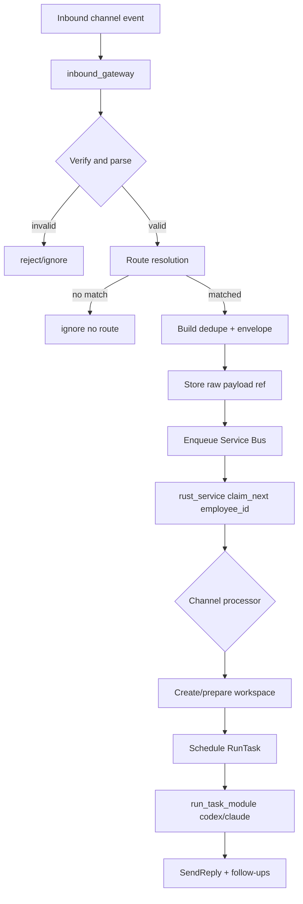

# Gateway Workflow (Current Code-Aligned)

This document reflects the actual ingress-to-worker path implemented in `scheduler_module`.

## Operational Invariants

- `inbound_gateway` requires `INGESTION_QUEUE_BACKEND=servicebus` (or compatible alias resolution).
- Worker (`rust_service`) consumes queue items; it is not the ingress webhook endpoint.
- Raw payload storage backend defaults to Supabase; Azure Blob is recommended for gateway production.
- Route config is loaded from `GATEWAY_CONFIG_PATH` (default `gateway.toml`).
- Employee config is loaded from `EMPLOYEE_CONFIG_PATH` (default `employee.toml`).

Runtime env policy:
- Runtime `.env` on VM should use unprefixed keys only.
- `DEPLOY_TARGET` is runtime policy metadata; it does not imply shell remapping from `STAGING_*` keys.

## Ingress Endpoints (Gateway)

- `POST /postmark/inbound`
- `POST /slack/events`
- `POST /bluebubbles/webhook`
- `POST /telegram/webhook`
- `POST /sms/twilio`
- `GET/POST /whatsapp/webhook`
- `POST /webhooks/google-drive-changes`
- Discord ingress is handled by a Discord gateway client started inside `inbound_gateway` when configured.

## Routing Resolution Order

For non-Discord HTTP ingress, gateway route resolution follows:
1. exact `channel + key` match in `gateway.toml`
2. channel default via `key = "*"`
3. email-only fallback by matching service mailbox in `employee.toml`
4. global gateway default `[defaults].employee_id`

Tenant resolution:
- per-route tenant_id
- else gateway default tenant_id
- else `default`

## Dedupe + Envelope Build

For each accepted inbound event:
- normalize channel-specific key
- derive route decision (tenant + employee)
- build dedupe key from tenant/employee/channel plus external message id (or payload hash)
- optionally upload raw payload (and large email attachments) to configured raw payload backend
- enqueue `IngestionEnvelope` to Service Bus queue

## Worker Consumption

Worker loop (`rust_service`):
- claim next message for its `EMPLOYEE_ID`
- process per channel:
  - quick-response path first for some channels (Slack/Discord/Telegram/WhatsApp/BlueBubbles)
  - fallback/full pipeline creates workspace + `RunTask`
- scheduler executes `RunTask`, then outbound `SendReply` and optional follow-up tasks

## Google Workspace Notes

- Docs/Sheets/Slides pollers run in gateway when enabled.
- Optional Google Drive push notification webhook triggers immediate single-file poll.
- Slides do not support Drive `files.watch`; Slides remain polling-only.

## Mermaid Flow

## Related Docs

- `DoWhiz_service/README.md`
- `DoWhiz_service/OPERATIONS.md`
- `DoWhiz_service/docs/staging_production_deploy.md`
